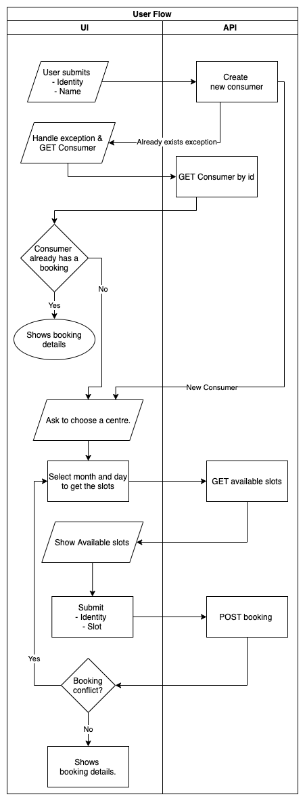
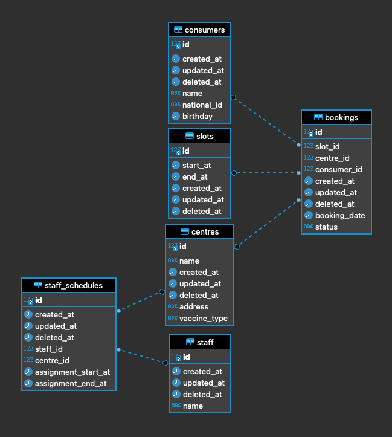

# vaccination-appointment-booking

[](https://app.codacy.com/gh/amitgiri0001/demo-vaccination-booking?utm_source=github.com&utm_medium=referral&utm_content=amitgiri0001/demo-vaccination-booking&utm_campaign=Badge_Grade_Settings)
[](https://github.com/amitgiri0001/demo-vaccination-booking/actions/workflows/test_check.yaml)

The repository is an attempt to replicate a vaccination booking system.

# Deployment
CI/CD is configured with github action and heroku for auto check and deployment.

# API Documentation
- [Postman docs](https://documenter.getpostman.com/view/12539300/TzzGFYJ3)
- [Swagger docs](https://vacc-api.herokuapp.com/explorer/#/)

> The server turns down the instance when there is no request for a certain duration to save the cost. It takes about 3-4 minutes for the server to warm up again after getting first request.

# Frontend
- [Repository](https://github.com/amitgiri0001/demo-vaccination-booking-ui) 
- [Try it here](http://vacc-ui.herokuapp.com/) 


# Requirement Analysis
- [Requirement Analysis and Assumptions doc](Requirement_analysis.md)

# User flow diagram


# ER diagram


# Code coverage

# API Development
## Install dependencies

Run the following to install packages:

```sh
npm install
```

To only install resolved dependencies in `package-lock.json`:

```sh
npm ci
```

## Run the application

```sh
npm start
```

You can also run `node .` to skip the build step.

Open http://127.0.0.1:3000 in your browser.

## Rebuild the project

To incrementally build the project:

```sh
npm run build
```

To force a full build by cleaning up cached artifacts:

```sh
npm run rebuild
```

## Fix code style and formatting issues

```sh
npm run lint
```

To automatically fix such issues:

```sh
npm run lint:fix
```

## Other useful commands

- `npm run openapi-spec`: Generate OpenAPI spec into a file
- `npm run docker:build`: Build a Docker image for this application
- `npm run docker:run`: Run this application inside a Docker container

## Tests

```sh
npm test
```


