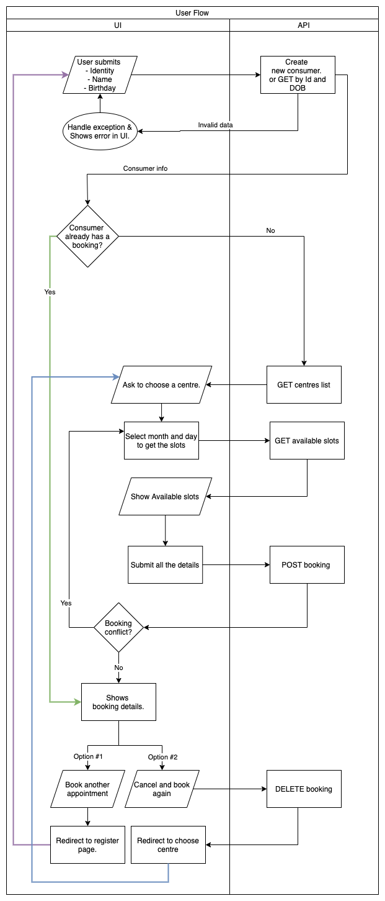

# vaccination-appointment-booking

The repository is an attempt to replicate a vaccination booking system.

# Development
## Install dependencies

Run the following to install packages:

```sh
npm install
```

To only install resolved dependencies in `package-lock.json`:

```sh
npm ci
```

## Run the application

```sh
npm start
```

You can also run `node .` to skip the build step.

Open http://127.0.0.1:3000 in your browser.

## Rebuild the project

To incrementally build the project:

```sh
npm run build
```

To force a full build by cleaning up cached artifacts:

```sh
npm run rebuild
```

## Fix code style and formatting issues

```sh
npm run lint
```

To automatically fix such issues:

```sh
npm run lint:fix
```

## Other useful commands

- `npm run openapi-spec`: Generate OpenAPI spec into a file
- `npm run docker:build`: Build a Docker image for this application
- `npm run docker:run`: Run this application inside a Docker container

## Tests

```sh
npm test
```

# User flow diagram


# ER diagram


# Code coverage

